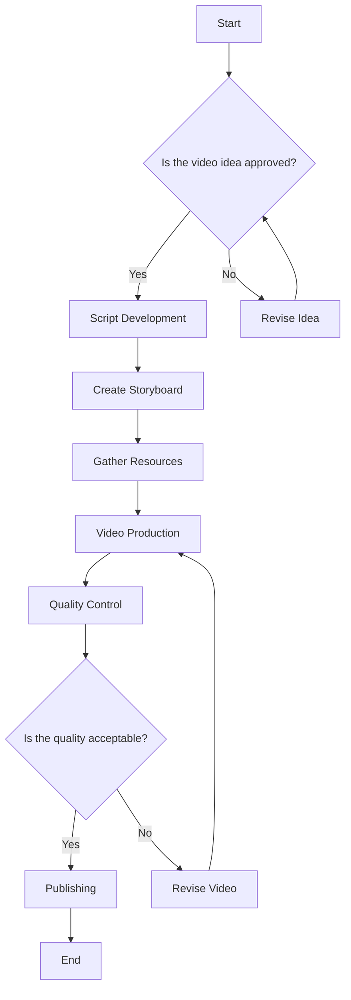

```mermaid
graph TD;
    A[Start] --> B{Is the video idea approved?};
    B -- Yes --> C[Script Development];
    B -- No --> D[Revise Idea];
    D --> B;
    C --> E[Create Storyboard];
    E --> F[Gather Resources];
    F --> G[Video Production];
    G --> H[Quality Control];
    H --> I{Is the quality acceptable?};
    I -- Yes --> J[Publishing];
    I -- No --> K[Revise Video];
    K --> G;
    J --> L[End];
```